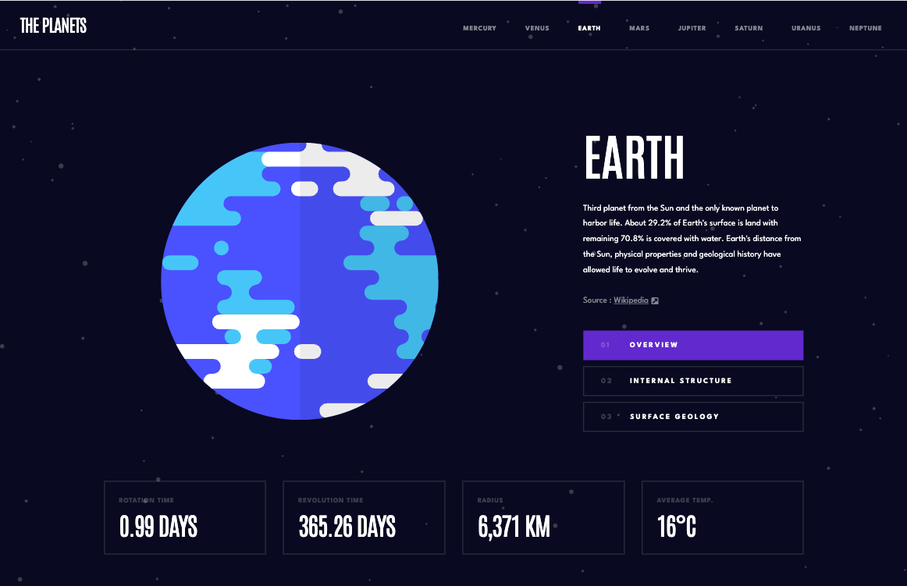
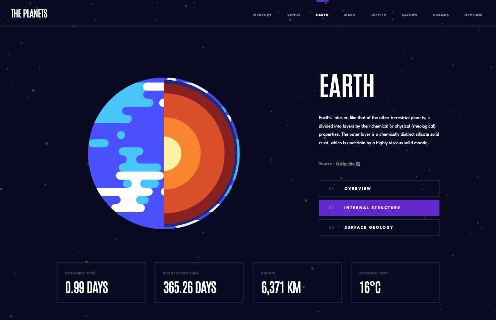
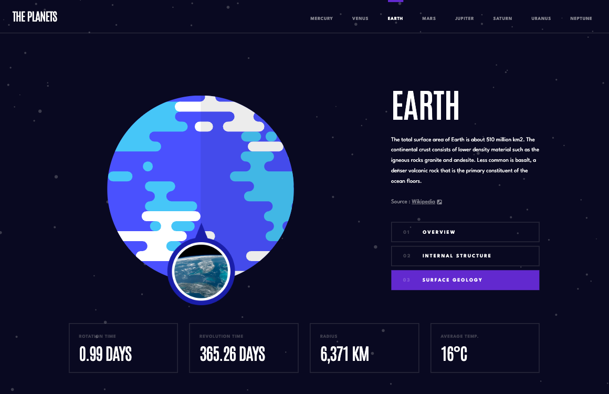
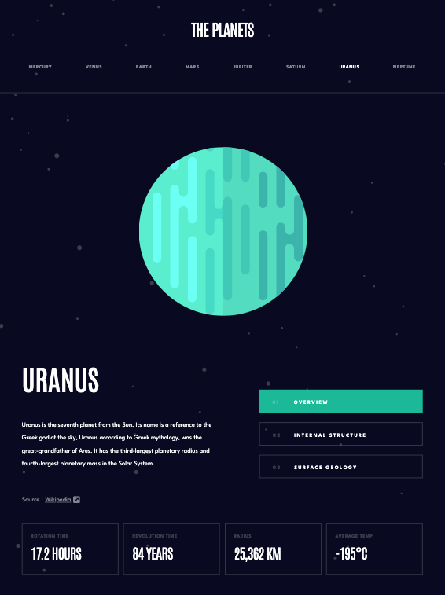
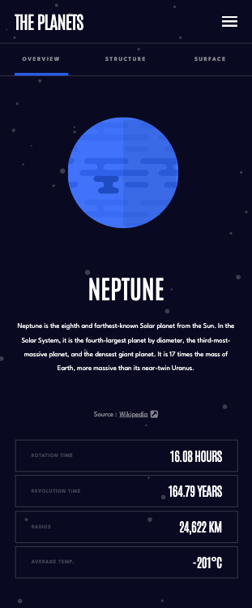
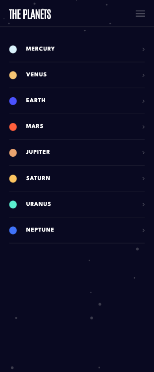

# Advice generator app 

## Table of contents

- [Overview](#overview)
  - [The App](#the-app)
  - [What it looks like](#what-it-looks-like)
  - [How to run the app ?](#how-to-run-the-app)
- [My process](#my-process)
  - [Built with](#built-with)
  - [What I learned](#what-i-learned)
  - [Continued development](#continued-development)

## Overview

### The App

This app presents the several planets of our solar system and sums up what we know about them. The website is also available on tablet and mobile devices.

Check it out here : http://astro-test-v2.surge.sh

### What it looks like 

Desktop version overview : 



Internal structure of the planet : 



Surface geology of the planet : 



Tablet version overview : 



Mobile version overview : 





### How to run the app locally ? 

Clone the project, then jump into your command line and run these :

```bash
# install dependencies
yarn

# start the application
yarn start

# open the application in the browser
open http://localhost:3000
```

## My process

### Built with

- Semantic HTML5 markup
- CSS custom properties
- Flexbox
- SCSS
- Mobile-first workflow
- [React](https://reactjs.org/) - JS library
- [Typescript](https://www.typescriptlang.org/) - JS with an emphasis on types
- [Figma] (https://www.figma.com/)

### What I learned

It was my first time working with figma designs, while discovering the tool I quickly got trapped in the "pixel perfect" mindset and so abused the 
```css 
position: absolute
```
 atribute. That mistake cost me a lot while trying to make the website responsive. I'll have a completely different approach in my future projects, and I pretty much think that I won't use absolute position anymore except for rare cases.

I've learned how to dynamically change my css classes thanks to javascript like so : 

```js
className={`planetLink ${window.location.pathname === `/${planet.name}` ? `planetLink--${planetId}` : '' }`}
```
Here the default className will be "planetLink" but if the slug matchs a planet name then the class 
```js 
planetLink--* 
``` 
will be added.

### Continued development

I witnessed some issues concerning the routing of the website. I also witnessed that the website doesn't display properly on laptop screensizes, it is due to the font-size that is not adaptating to the loss of screen size and also to the absolute position of some elements.

I will try to fix all of these in the near future.
